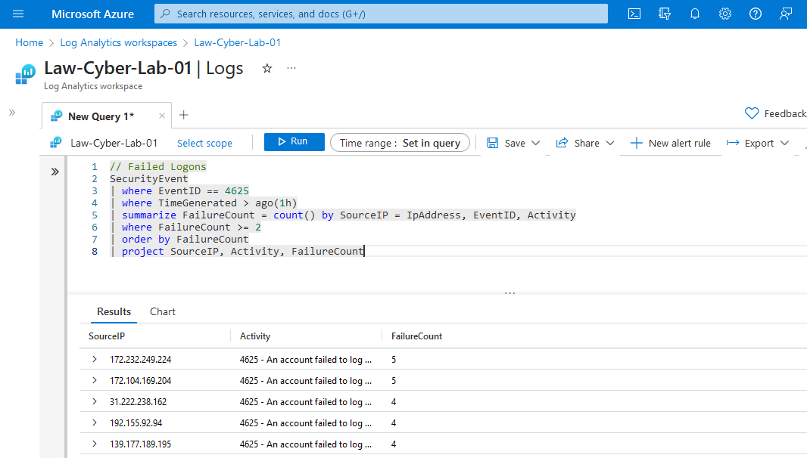

<link href="./style.css" rel="stylesheet"></link>

# KQL - Log Analytics

KQL Practice Queries:

```
SecurityEvent
| where EventID == 4625


SecurityEvent
| where EventID == 4625 and Account like '\\Administrator'
| where TimeGenerated > ago(10m)


SecurityEvent
| where EventID == 4625 and Account like '\\Administrator'
| where TimeGenerated > ago(10m)


// Failed Logons
SecurityEvent
| where EventID == 4625
| where TimeGenerated > ago(1h)
| summarize FailureCount = count() by SourceIP = IpAddress, EventID, Activity
| where FailureCount >= 2
| order by FailureCount
| project SourceIP, Activity, FailureCount


//Rename fields by setting [custom-name = target-field-name]
SecurityEvent
| where EventID == 4625
| where TimeGenerated > ago(1h)
| summarize FailureCount = count() by SourceIP = IpAddress, EventID, Activity

```


