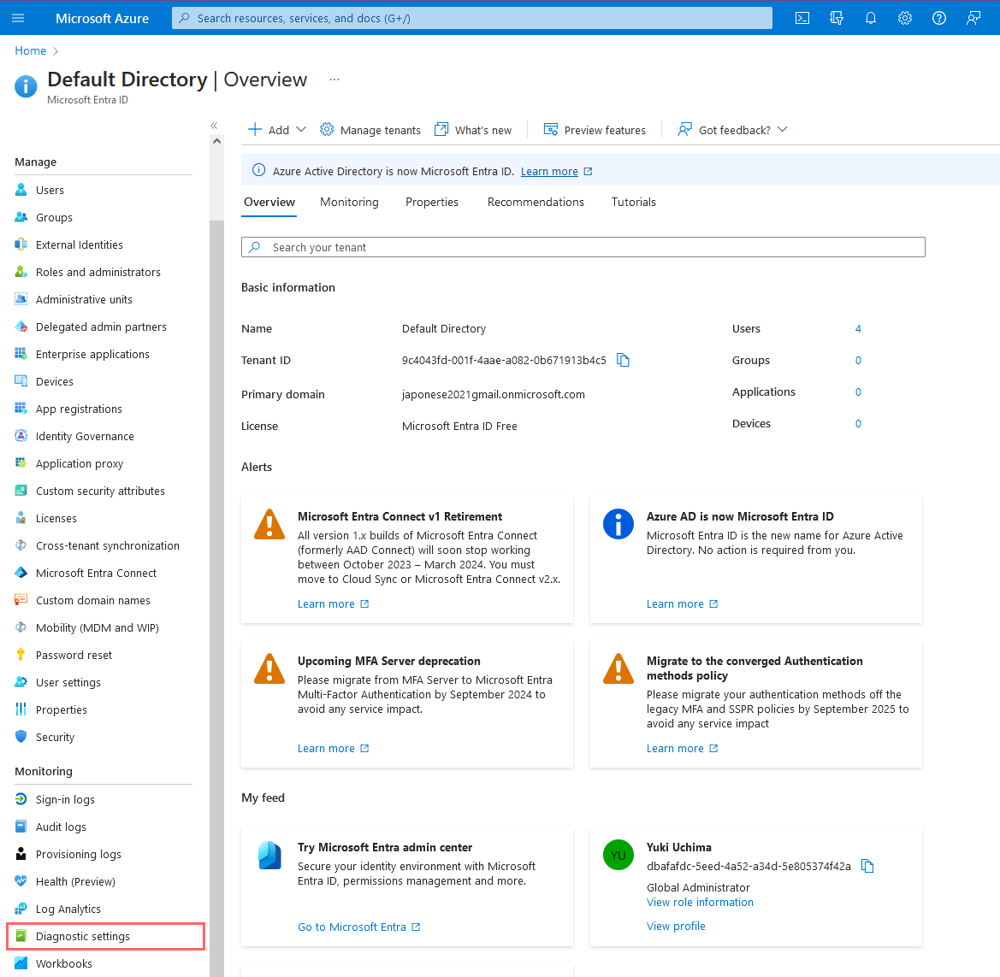

<link href="./style.css" rel="stylesheet"></link>

# Enabling Log Collection from VM's and NetSec Groups

- Create Azure Storage Account
- Enable Flow Logs for both VM's (Windows/Linux)
- Create Data Collection Rules
- Special Data Collection including Malware Tampering

## Create Azure Storage Account

    - Storage account name: sacyberlab024

## Enable Flow logs for both Network Security Groups

- Two flow logs, 1 each for the 2 virtual VM's

    Select the two resources by clicking "+ Select Resource"

    Create flow log
        - Ensure region is same as before (US EAST 2)

## Create Data Collection Rules

- Determines which log information to be forwrded to Log Analytics Workspace

        Ensured both VM's are actively running

    Add Data Collection Rules:
    - Agents
        - Data Collection Rules

    Name the rule: "dcr-all-vms"
    Platform type: all

    Add resources to include RG-Cyber-Lab group, both the linux and windows VM

    Facility LOG_AUTH set to LOG_DEBUG Level
    All others are "none"

    Set Windows Event Logs and the destination

## Configure Special Windows Event Data Collection (Defender and Windows Firewall)

<!--
Link source:
https://github.com/joshmadakor1/Cyber-Course-v2/blob/main/Special-Windows-Event-Data-Collection-Rules/Rules.txt

Windows Defender Malware Detection XPath Query
Microsoft-Windows-Windows Defender/Operational!*[System[(EventID=1116 or EventID=1117)]]

Windows Firewall Tampering Detection XPath Query

Microsoft-Windows-Windows Firewall With Advanced Security/Firewall!*[System[(EventID=2003)]]

-->

    Select Custom and add XPATH queries
    - Malware detection XPATH
    - Malware Tampering Detection XPath

    Confirm Connection is completed for logging in Agents

    - If VM not connected, then manually force

    Query log analytics for the following:
        Syslog (linux)
        SecurityEvent (Windows)
        AzureNetworkAnalytics_CL (NSG's)

 
 
 
 

# Tenant-Level Monitoring/Logging

- Keep track of sign-in activity
- Audit trail of changes made in Azure AD for particular tenant

## Azure Active Directory Logging (in progress)

<!-- - Microsoft Entra ID

        Create and configure collection of Audit and SignIn logs

        Diagnostic setting name set to "ds-audit-signIn"

  
   -->
