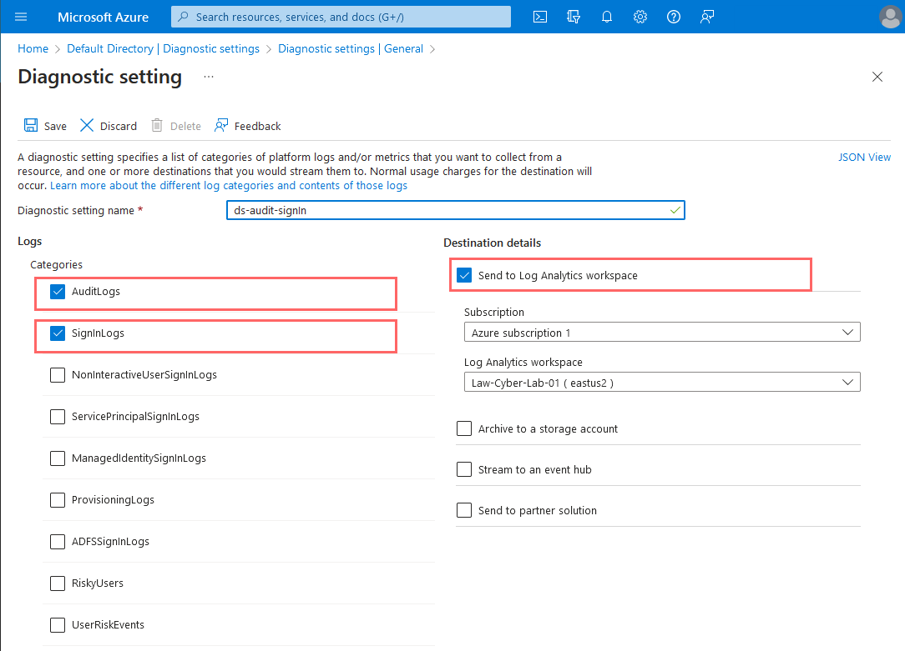
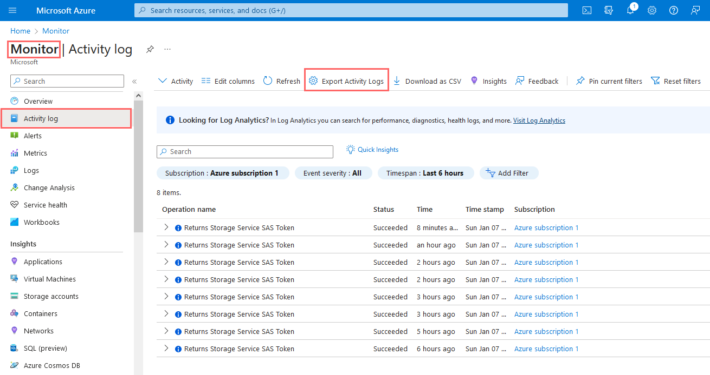

<link href="./style.css" rel="stylesheet"></link>

# Enabling Log Collection from VM's and NetSec Groups

- Create Azure Storage Account
- Enable Flow Logs for both VM's (Windows/Linux)
- Create Data Collection Rules
- Special Data Collection including Malware Tampering

## Create Azure Storage Account

    - Storage account name: sacyberlab024


## Enable Flow logs for both Network Security Groups

- Two flow logs, 1 each for the 2 virtual VM's


    Select the two resources by clicking "+ Select Resource"


    Create flow log
        - Ensure region is same as before (US EAST 2)


## Create Data Collection Rules

- Determines which log information to be forwrded to Log Analytics Workspace

        Ensured both VM's are actively running


    Add Data Collection Rules:
    - Agents
        - Data Collection Rules


    Name the rule: "dcr-all-vms"
    Platform type: all


    Add resources to include RG-Cyber-Lab group, both the linux and windows VM


    Facility LOG_AUTH set to LOG_DEBUG Level
    All others are "none"


    Set Windows Event Logs and the destination


## Configure Special Windows Event Data Collection (Defender and Windows Firewall)

<!--
Link source:
https://github.com/joshmadakor1/Cyber-Course-v2/blob/main/Special-Windows-Event-Data-Collection-Rules/Rules.txt


Windows Defender Malware Detection XPath Query
Microsoft-Windows-Windows Defender/Operational!*[System[(EventID=1116 or EventID=1117)]]

Windows Firewall Tampering Detection XPath Query

Microsoft-Windows-Windows Firewall With Advanced Security/Firewall!*[System[(EventID=2003)]]

-->

    Select Custom and add XPATH queries
    - Malware detection XPATH
    - Malware Tampering Detection XPath


    Confirm Connection is completed for logging in Agents

    - If VM not connected, then manually force


    Query log analytics for the following:
        Syslog (linux)
        SecurityEvent (Windows)
        AzureNetworkAnalytics_CL (NSG's)


<br>
<br>
<br>
<br>

## Tenant-Level Monitoring/Logging

- Keep track of sign-in activity
- Audit trail of changes made in Azure AD for particular tenant

### Azure Active Directory Logging (in progress)

- Microsoft Entra ID

```
Create and configure collection of Audit and SignIn logs

Diagnostic setting name set to "ds-audit-signIn"
```




        Verified Log Tables exist


        Although no results populates in query, table exists


<br>
<br>
<br>

### Show Logs in MS Entra ID (Azure Active Directory)

- Create new dummer user
- Sign in with dummy user
- Assign role of Global Administrator
- Delete dummy_user
- Observe Audit logs in Log Analytics Workspace of previous actions


### KQL querying when Global Administrator has been initiated

        Note: "project" is limiting the columns to specific headers to be displayed to reduce noise of unnecessary information

```

AuditLogs
| where OperationName like "add member to role" and Result like "success"
| where TargetResources[0].modifiedProperties[1].newValue like "Global Administrator" or TargetResources[0].modifiedProperties[1].newValue like "company administrator"
| order by TimeGenerated desc
| project TimeGenerated, OperationName, AssignedRole = TargetResources[0].modifiedProperties[1].newValue, Status = Result

```


### Attacker - generate logs simulating brute force attacks

- New user "attack-user"
- Simulate attempts to log in through azure directory


<br>
<br>
<br>
<br>

## Subsrciption-Level Monitoring/Logging (Activity Log)

- Enabling activity log, including logs for:

  - changing RG
  - creating RG
  - deleting RG

```
From Azure portal, open "Monitor"
Open "Activity Log" then "Export Activity Logs"
```



```
Add new diagnostic settings
```


```
Confirmed new settings are added for AzureActivity logs
```


### Creating new resource groups

- "Scratch-Resource-Group"
- "Critical-Infrastructure-Wastewater"


```
Verified in AzureActivity, logs are created for creationg of groups
Next, deleting previous groups created
```


```
Both subscriptions have been successfully deleted with logs below indicating when they were created

```


<br>
<br>
<br>
<br>

## Resource-Level Logging (Diagnostic Setting)

- Enabling Resource-level (Data-Plane) logging into Log Analytics Workspace for:
  - Storage
  - Key Vault

### Storage Accounts Logging

```
Configure Logging for Azure Storage
    Storage Accounts
        Diagnostic Settings Configuration
            Blob -> Essentially uploading files (txt)


```


```
Test blob text file
    - Storage Account
        - Containers (inside storage account)
            - New Container ("test")
                - Upload text file that was created

```


```
Upload blob sample text file to be logged
```


#### Review Blob Collections Data in Log Analytics


- Table name is "StorageBlobLogs"
- Queried and found log of when file was uploaded


```
Deleting blob container, and then observing log of deletion
```


### Creating Key Vault and Logging it

- Create Key Vault
- Create Secret to store in Key Vault
- Log secret to Analytics Workspace when users access it


```
Create key vault

```


```
Stored secret inside key vault
```


```
Setting up diagnostics settings for secret to be logged
    - From inside Key Vaults, go to Diagnostic Settings to create a new setting
```


#### Observing Key Vault Logs

```
Key Vault Test Logs
// List out Secrets
AzureDiagnostics
| where ResourceProvider == "MICROSOFT.KEYVAULT"
| where OperationName == "SecretList"

// Attempt to view passwords that don't exist
AzureDiagnostics
| where ResourceProvider == "MICROSOFT.KEYVAULT"
| where OperationName == "SecretGet"
| where ResultSignature == "Not Found"

// Viewing an actual existing password
AzureDiagnostics
| where ResourceProvider == "MICROSOFT.KEYVAULT"
| where OperationName == "SecretGet"
| where ResultSignature == "OK"

// Viewing a specific existing password
let CRITICAL_PASSWORD_NAME = "Tenant-Global-Admin-Password";
AzureDiagnostics
| where ResourceProvider == "MICROSOFT.KEYVAULT"
| where OperationName == "SecretGet"
| where id_s contains CRITICAL_PASSWORD_NAME

// Updating a password Success
AzureDiagnostics
| where ResourceProvider == "MICROSOFT.KEYVAULT"
| where OperationName == "SecretSet"

// Updating a specific existing password Success
let CRITICAL_PASSWORD_NAME = "Tenant-Global-Admin-Password";
AzureDiagnostics
| where ResourceProvider == "MICROSOFT.KEYVAULT"
| where OperationName == "SecretSet"
| where id_s endswith CRITICAL_PASSWORD_NAME
| where TimeGenerated > ago(2h)

// Failed access attempts
AzureDiagnostics
| where ResourceProvider == "MICROSOFT.KEYVAULT"
| where ResultSignature == "Unauthorized" -->

```
