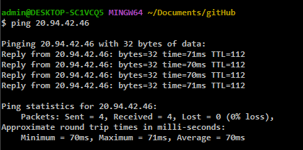

<link href="./style.css" rel="stylesheet"></link>

# AZURE

## Virtual Machines

    Created Virtual Labs
        - Windows-vm
        - Linux-vm


## Set Network Security Groups (Allow all traffic)

    Windows Virtual Environment


Updated Security Group to allow all traffic


<br>
<br>

    Linux Virtual Environment


Updated Security Group to allow all traffic in


<br>
<br>

## Remote Access Virtual Machines


## Disable Firewalls




## Install Database (SQL Server Evaluation)


## Install SSMS (SQL Server Management Studio)


    Enabling logging for SQL Server to be ported into Windows Event Viewer


## Configure the audit object access setting in Windows using auditpol

```
auditpol /set /subcategory:"application generated" /success:enable /failure:enable
```

## Linux SSH


## Azure: Logging and SecOps

**Creating another VM to attack linux and windows VM**


    Remote connect to attack-vm


### From Attack-VM, attempt login to Windows-VM


    Attempting to login to Windows-VM SSMS database from Attack-VM


### From Attack-VM, attempting login to Linux-VM


### Review event logger of previous attempts to log ins (Brute Force)


### Logs in Linux


