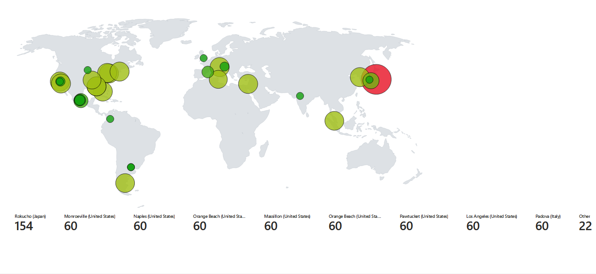
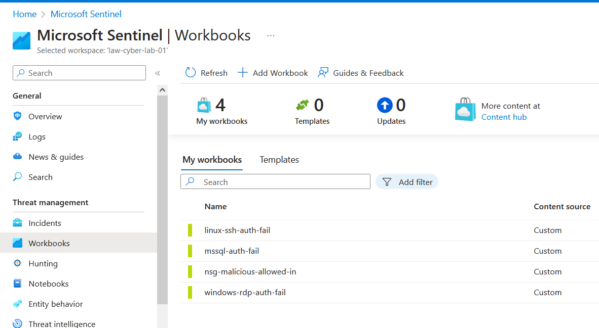

<link href="./style.css" rel="stylesheet"></link>

# Azure Sentinel (Pre-hardening)

## Create Log Analytics Workspace (log aggregator)

    In Azure portal, [Log Analytics Workspaces]


## Setup Sentinel and connect to Log Analytics Workspace


### Create geoip watchlist

    - Name/Alias: geoip
    - Source type: Local File
    - Number of lines before row: 0
    - Search Key: network


### Query in Log Analytics Workspace

    Query (KQL):
        _GetWatchlist("geoip")


<br>
<br>
<br>
<br>

### Sentinel Workbook - BEFORE Hardening the first 24 hours

```
In MS Sentinel, add a workbook using json file to pull log information
```


```
First map showing sources for failed linux ssh
```



```
Second workbook: failed MSSql authorization
```


```
Third workbook: Network Security Group log of malicious actors allowed in with minimal controls
```


```
Fourth workbook: Windows remote login fails
```


```
All four workbooks created to log IP address locations
```



> Next: [Azure Sentinel in Workspace Pt2](/azureSentinelHardening.md)
