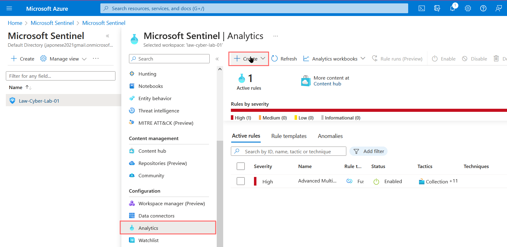

<link href="./style.css" rel="stylesheet"></link>

# Azure Sentinel (Alert Creation)

- Observe KQL query showing result of hundreds of failed login attempts
- Create Scheduled Query Rule
- Based on that query, create an alert in Sentinel
- Trigger alerts in order to collect log of incident in Sentinel

<br>
<br>
<br>

## ALERTS

### First, observed log showing FailureCount exceeding beyond 10 attempts (ex. 1037 attempts in previous 24 hours)

```
KQL:

SecurityEvent
| where EventID == 4625
| where TimeGenerated > ago(1d)
| summarize FailureCount = count() by AttackerIP = IpAddress, EventID, Activity, DestinationHostName = Computer
| where FailureCount >= 10
| order by FailureCount desc

```


<br>
<br>
<br>
<br>

## Creating Scheduled Query Alert in Sentinel

- Create new alert query

```
In sentinel, navigate to Analytics then create "Scheduled Query Rule"
```



```
Create alert
    - Set name
    - Description
```


```
Rule Query
    - Failures occurring more than 10 times in past 60 min
```


```
Setting Alert Enhancement
    - Classify by AttackerIP
    - Also classify by HostName entity, Destination
```


```
Query Scheduling
    - Run query every 5 minutes for this exercise
    - Also find any data from last 24 hours
```


```
Set Alert Threshold
    - Generate any results

Event Grouping
    - Reduces amount of results and groups them
```


```
Simulated Attack
    - Attempted to RDP into Windows VM with 10+ failed login attempts from my own laptop
```


<br>
<br>
<br>
<br>

### Alert - Brute Force Successful Azure Active Directory

- Simulate brute force successful login via attacker VM
- Trigger Alert

          Alert Rule checking for brute force attempt to SQL Server

  
  

          Alert generated for the SQL Server

  

<br>
<br>
<br>
<br>

### Alert - Brute Force Successful MSSQL Logon

- Simulate brute force MS SQL logon attempt
  
  Attacker IP represents my attacker VM I was using at the time for all of these simulations.
  
  

<br>
<br>
<br>
<br>

### Alert - Malware Test

- Run malware simulator file to trigger windows security event in VM

```
File content that triggers malware alert:

$TOTAL_VIRUSES_TO_MAKE = 1

$firsthalf = 'X5O!P%@AP[4\PZX54(P^)7CC)7}$EICAR'
$secondhalf = '-STANDARD-ANTIVIRUS-TEST-FILE!$H+H*'

$count = 0

while ($count -lt $TOTAL_VIRUSES_TO_MAKE) {

    Write-Host "Generating: EICAR-$($count).txt"
    "$($firsthalf)$($secondhalf)" | Out-File -FilePath "EICAR-$($count).txt"
    $count++
}

```

        Powershell runs simulated malware file (bad)


        Sentinel detects malware file has been executed


<br>
<br>
<br>
<br>

### Alert - User viewing secret password

- User access secrets to retrieve password


            Alert generated after retrieval


<br>
<br>
<br>
<br>

### Alert - Windows Firewall Tampering

- Firewall changes creates alert in sentinel


        Made firewall changes in windows VM

        
        Alert query produces results


        Sentinel Alert has been triggered


<br>
<br>
<br>
<br>

### Alert - Pass Change

- Reset password multiple times to trigger alert
- Malicious actors may attempt to allow user to login after failed attempts


    New dummy user created, resetting password multiple times


    Alert generated for excessive password resets


