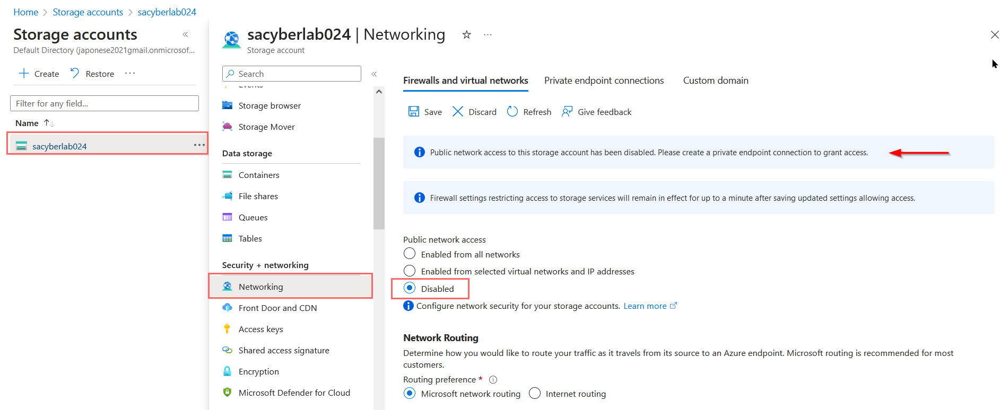
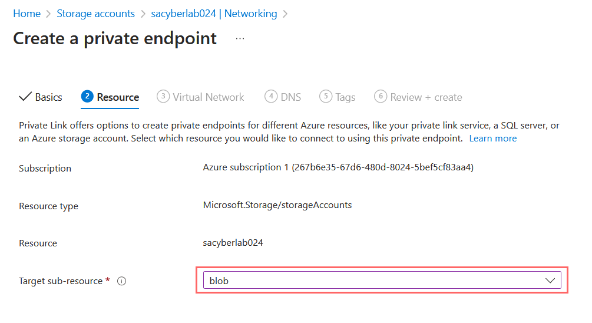

<link href="./style.css" rel="stylesheet"></link>

# Securing Cloud

    1. Inspect MDC Secure Score
    2. Inspect MDC Recommendations
    3. Enable MDC Regulatory Compliance
        - NIST 800-53 (Security and Privacy Controls)

### Microsoft Defender For Cloud Secure Score

    Current Score at 50%

### MDC Recommendations

    Reviewing Recommendations

 
 

### MDC Regulatory Compliance Enabled

    In regulatory compliance, proceed to manage compliance policies

    Inside Azure Subscription, proceed to security policies and search for 800-53

    Enable NIST 800-53 security policy

    Confirmed NIST 800-53 has been applied

 
 
 
 

### Securing key vault with private endpoint connection

- Creating private endpoint will result to private address when accessing from VM (IP: 10.0.0.#)
- This is more secure since it can only be accessed with same virtual network and not from the public

 

    With the key vault, proceed to networking and disable public access

    In Private Endpoint Connections tabe, create a new private endpoint "PE-AKV"

    Fill information corresponding to subscription and resource group

 
 
 
 

### Securing Blob storage with private endpoint connection

- Similar to previous securing of key vault, create private endpoint to the storage in the resource group

 

    In storage accounts, procced to disable public network access in the networking tab

    Proceed to create a private endpoint for the storage account

### Verify endpoints are created in topology

    Inside Network Watcher, select topology and filter scope to corresponding resource group and locations

    Resource Group: RG-Cyber-Lab
    Locations: East US 2

 
 
 
 

### Creating subnet on virtual network

    Add new network security group for subnet

    In the appropriate virtual network, Lab-VNet for this instance, add new subnet (nsg-subnet)

    Inside network watcher topology, observe subnet has been added and ready to be configured

