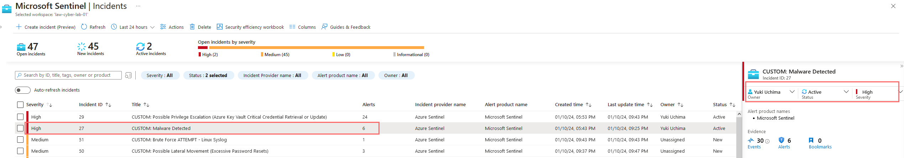
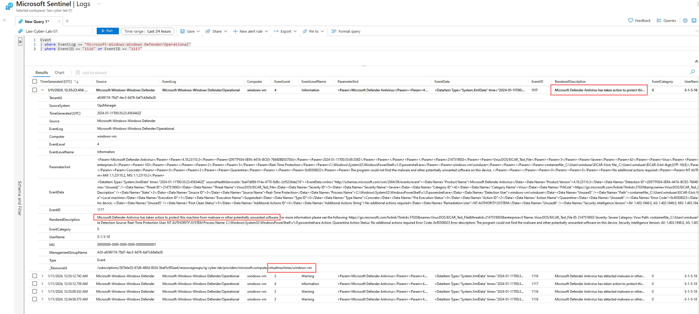
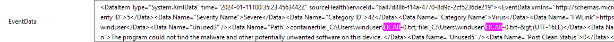
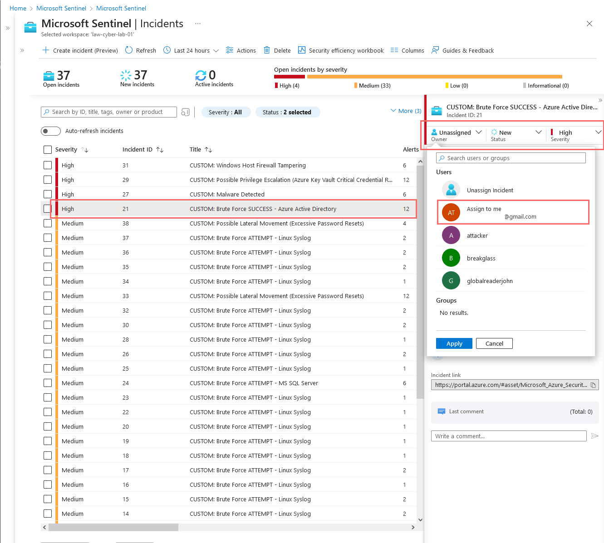
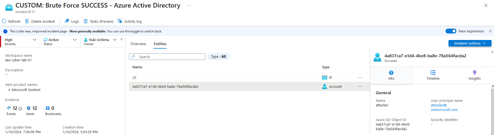
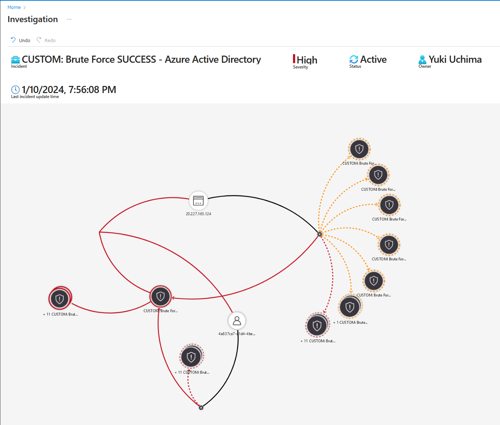
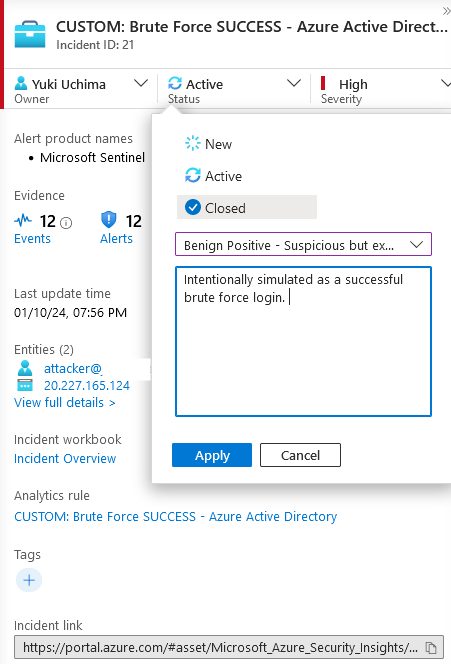
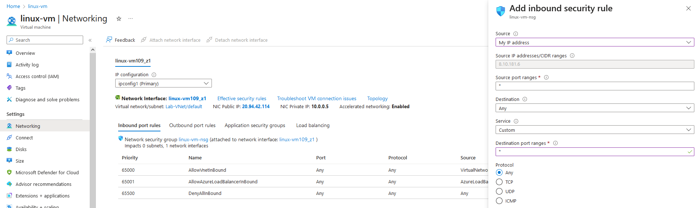

<link href="./style.css" rel="stylesheet"></link>

# Incident Response

1. Step 2 Detection and Analysis
2. Containment, Eradication, Recovery
   - [Reference Playbook](./assets/data/Incident%20Management%20Playbook.pdf)

## Incident Response - Malware (Simulated)

    - Review Malware Incident
    - Refer to playbook



    Review KQL details, looks like resolved automatically by windows defender. Not much action required but to investigate

    According to playbook, if infected and other systems on network impacted, would require quarantine and restoration by clean install or system image



    Determined "EICAR" files and can be closed as it is used for testing malware triggers

    "Benign Positive"



<br>
<br>
<br>
<br>

## Incident Response - Brute Force Successful

### Step 1 - Detection and Analysis

    - Taking a look at simulated brute force attack where I used attacker VM in order to create incident alert

#### Set Severity, Status, Owner

    Review and take ownership of indicent then review full details



    This instance, it was me testing this alert by simulating a brute force.
    Entities include my ip and account associated with this incident using ATTACK VM



#### Investigate incident

    Investigations shows incidents related to the user committing them



#### Determine true positive

    In this instance, simulation is "true" positive, but let's close out ticket as it is not an actual incident, but a simulation



#### Containment, Eradication, Recovery

```
Incident Description
    This incident involves observation of potential brute force success against Azure Active Directory


Initial Response Actions
    Verify the authenticity of the alert or report.
    Immediately identify and Revoke Sessions/Access for affected user
    Identify the origin of the attacker and determine if they are attacking or involved with anything else
    Assess the potential impact of the incident.
    What type of account was it?
    What Roles did it have?
    How long has it been since the breach went unattended?


Containment and Recovery
    Lock down the NSG assigned to that VM/Subnet, either entirely, or to allow only necessary traffic
    Reset the affected user’s password and Roles if applicable
    Enable MFA
    Consider preventing any logins from outside the US with Conditional Access

Document Findings and Close out Incident

```

    Locking Down NSG
    Deleted Previous "DANGER..." rule and hardened security by only allowing my IP address to access VM

    Continued to apply to other VM's


