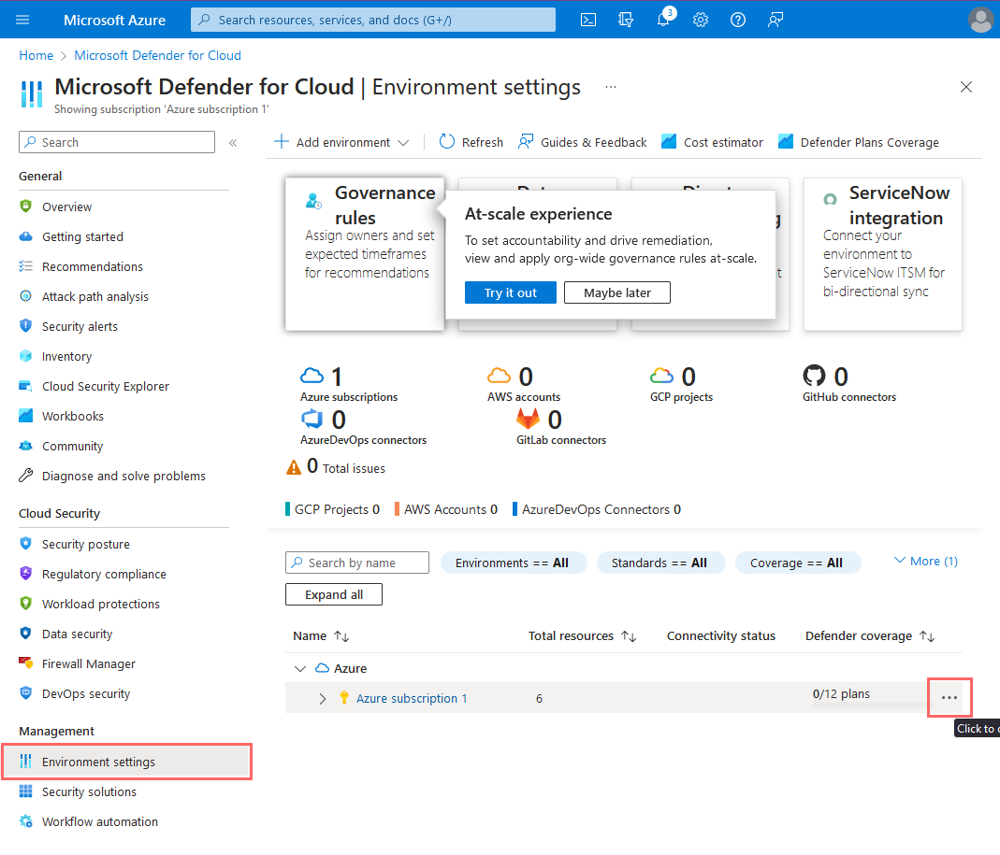

<link href="./style.css" rel="stylesheet"></link>

# MS Defender for Cloud

- Allows forwarding data from VM to log analytics

## Defender for Cloud Settings

    Environment Settings: Enable Servers and SQL

    Enable "All Events" for Data Collection

    Verify plans are active

    Enable the following Plans
    Update Server Settings

## Enable MS Defender for Cloud Continuous Export

